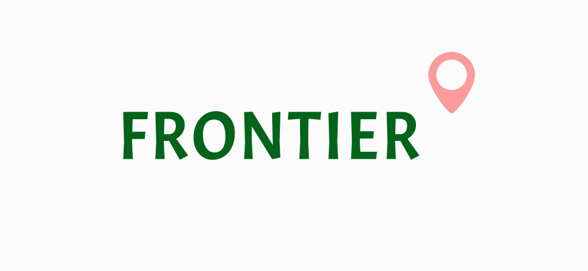

# Frontier

  

 

A travel app for solo travellers who want to explore the globe without fear. Be part of an online community where you can share your unique travel routes, make connections and explore areas with other like-minded travellers. A focus on safety to achieve fearless travel for all users. 

Check out a demo here: 

## Screenshots

 

## Getting started

These instruction will help you setup a local development instance of the app.

### get the repo

fork this repository

`git clone https://github.com/Hough-Lab/Frontier`

### Setup

##### Prerequisites

You will need to have an active Google API key along with a Cloudinary API key to run the App both on mobile and web versions.

##### Steps

- Create `config.ts` file in `/Client` adjust the necessary variables to match your system. There is a `config-example` file to help you with this process, replace the needed fields with your own IP address and API keys.

- Create `config.js` file in `/server/src`. There is a `config-example` file to help you with this process. Edit the file with your database details.

To be able to open the mobile App, you need to either download the Expo Go app on your mobile or have the Android Studio installed in your computer.

2 separate installations are required: one for the backend and one for the frontend.

#### Backend

Make sure you have postgreSQL installed on your machine [mac](https://www.postgresql.org/download/macosx/) || [windows](https://www.postgresql.org/download/windows/) 
Go to the `/server` and run:

- `npm i`

#### FrontEnd

Go to the `/Client` and run `npm i`.

### Start the App

From the root folder of the project change into `/server/src` and `npm start`

##### Mobile App

From the root folder of the project change into `/Client/mobile` and `npm start`

##### Web App

From the root folder of the project change into `/Client/web/src` and `npm start`

## Tech-Stack

### Frontend

- [TypeScript](https://www.typescriptlang.org)
- [Redux](https://redux.js.org/) 
- [Lottie](https://airbnb.io/lottie/#/) 

##### Mobile App

- [React Native](https://reactnative.dev/) with [Expo](https://expo.io/)

##### Web App

- [React](https://reactjs.org/)

### Backend

- [JavaScript](https://www.typescriptlang.org)
- [Node.js](https://nodejs.org/)
- [Express](https://expressjs.com)
- [Sequelize](https://sequelize.org/) 
- [PostgreSQL](https://www.postgresql.org/) 

### API

- [Google Places API](https://cloud.google.com/maps-platform/places)
- [Cloudinary](https://cloudinary.com/)

## Observations

##### Room for improvements

- Better typing for TypeScript
- Write tests
- Better UI for web version

##### Next orders

- Deploy Frontier to the play store
- Add connecting to friends + chat features
- Make it friends with iOS

## Contributors

##### Co-creators and Full-Stack Engineers:

- Alexandra Burnside [GitHub profile](https://www.github.com/aliburnside)
- Bibek Gurung [GitHub profile](https://www.github.com/bibekgurunguh)
- Caroline Victor-Pujebet [GitHub profile](https://www.github.com/Carolinevp)
- David Solsona [GitHub profile](https://www.github.com/davidsolsonapuertas)
- James Hough [GitHub profile](https://www.github.com/Hough-Lab)
- James Poulton [GitHub profile](https://www.github.com/JMPoulton33)

 

